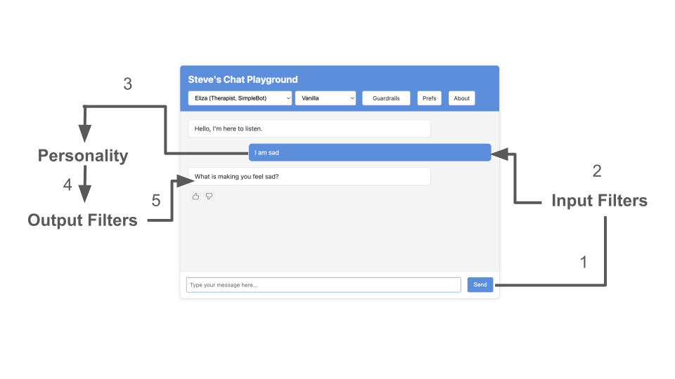

# Steve's Chat Playground Documentation

Welcome to the documentation for Steve's Chat Playground! This guide will help you understand the project's architecture, features, and how to extend it.

## Core Concepts

### [Models](models.md)
- Available chat models (SimpleBot, OpenAI, etc.)
- Model capabilities and limitations
- Configuration and integration details
- How models power different personalities

### [Personalities](personalities.md)
- Available chatbot personalities
- How personalities combine models with scripts/prompts
- Creating and configuring new personalities
- Security testing personalities

### [Guardrails](guardrails.md)
- Input and output filters for content moderation
- Local vs. API-based guardrails
- Available filter types (blocklist, heuristic, AI-powered)
- Security features and limitations

## Data Flow: How Guardrails and Personalities Work Together

When a user submits a message, it first passes through a series of configurable **Input Filters** (guardrails) that can block or modify risky content. The filtered prompt is then passed to a selected **Personality**, which determines how the chatbot behaves (e.g., therapist, banker, jailbroken model). A Personality is defined as **Model + Instructions**. After generating a response, the output is then screened by **Output Filters** (guardrails) to catch policy violations before being displayed in the chat window.

This layered design makes it easy to test how different filters and bot configurations affect system behavior—all without modifying backend code. Input and output filters are both types of guardrails, designed to help ensure the personality stays in alignment with your safety and policy requirements.

## Testing & Validation

### [Tests](tests.md)
- Automated test suite overview
- Test data and methodology
- Running and extending tests
- Integration with API key management

## Advanced Topics

### [API Key Management](api_key_management.md)
- Overview of the flexible API key management system
- How to work with multiple providers and storage strategies
- Security considerations and best practices
- Extending the system for new providers

### [Extensibility](extensibility.md)
- How to add new features to the playground
- Creating custom personalities, styles, and guardrails
- API key management for extensions
- Best practices and guidelines

## Getting Started

1. Start with the [README](../README.md) for a high-level overview
2. Review [Models](models.md) and [Personalities](personalities.md) to understand the core functionality
3. Check [Guardrails](guardrails.md) for security features
4. Use [Tests](tests.md) to validate your changes
5. Review [API Key Management](api_key_management.md) if you plan to use API-powered features
6. See [Extensibility](extensibility.md) when you're ready to customize or extend the playground

## Contributing

When contributing to the project:
1. Review the relevant documentation for the area you're working on
2. Follow the guidelines in [Extensibility](extensibility.md)
3. Run the test suite to validate your changes
4. Update documentation as needed

## Questions?

For questions or support:
- Check the [GitHub repository](https://github.com/virtualsteve-star/chat-playground)
- Contact Steve Wilson on [LinkedIn](https://www.linkedin.com/in/wilsonsd/) 